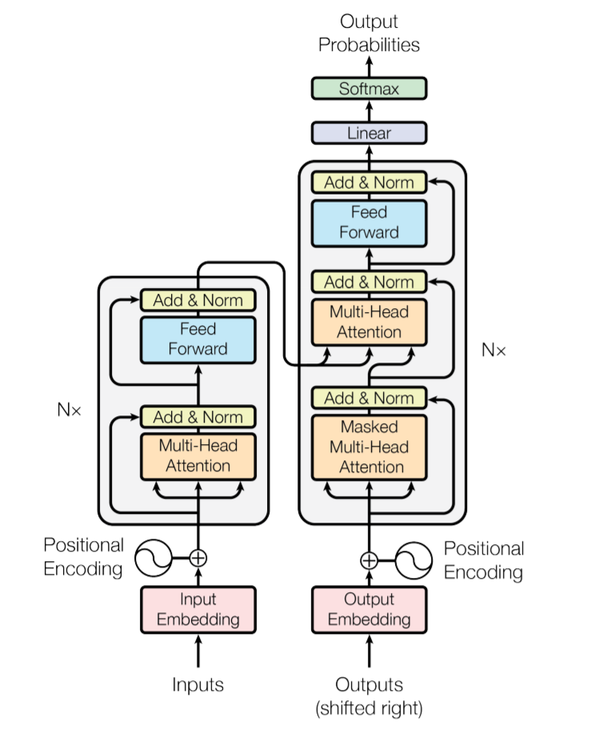
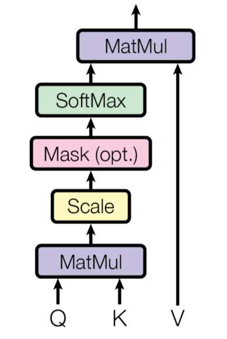

# Ruba-i-GPT

This project implements a neural network-based Persian poem generator using PyTorch. The model is trained on a dataset of Persian poems like (خیام، حافظ، فردوسی) and can generate new poems in a similar style.

## Table of Contents
- [Ruba-i-GPT](#ruba-i-gpt)
  - [Table of Contents](#table-of-contents)
  - [Project Structure](#project-structure)
  - [How I made it happen](#how-i-made-it-happen)
  - [Attention is All you need - *Model Architecture*](#attention-is-all-you-need---model-architecture)
  - [Training](#training)
  - [Generation](#generation)

## Project Structure

The main script contains the following components:

1. Data preprocessing
2. Tokenization and encoding
3. Model definition
4. Training loop
5. Poem generation

## How I made it happen

The model is trained on the [Ganjoor-Databse](https://ganjoor.net/) which contains about 60000 lines of text. 
I first cleaned and preprocessed the dataset with **hazm** and then wrote a custom encoder and decoder function, then wrote custom encoder and decoder functions. I also added some of the most common character pairs to the encoders (turning them into tokens), improving the tokenization process.

1. The script reads preprocessed Persian poems from a file named `poems_preprocessed.txt`.
2. It creates a character-to-index and index-to-character mapping for tokenization.
3. The most common character pairs are identified and added to the vocabulary to improve efficiency.
4. The text is encoded using the created mappings.
5. A neural network model is defined using a **transformer-like architecture**.
6. The model is trained on the encoded data.
7. After training, the model can generate new Persian poems.

## Attention is All you need - *Model Architecture*

The model uses a transformer-like architecture with the following components:

- Token and positional embeddings
- Multi-head self-attention layers
- Feedforward neural networks
- Layer normalization and batch normalization

  

**I implemented all the self attention mechanism from scratch and here is a summary:**

- #### `Head`: 
  - Implements a single attention head using query, key and value 
   
  

      
  

  
- `MultiHeadAttention`: Combines multiple attention heads
- `FeedForward`: Implements the feedforward network
- `Block`: Combines attention and feedforward layers
- `MultiLayerBigram`: The main model class

## Training

The model is trained using the following hyperparameters:

- Batch size: 128
- Block size (sequence length): 256
- Embedding dimension: 384
- Number of attention heads: 3
- Number of layers: 2
- Dropout rate: 0.2

The training process uses the Adam optimizer with a learning rate of 1e-7 and weight decay of 1e-8. A learning rate scheduler is implemented to reduce the learning rate towards the end of training.
After training, I got the train loss to be around 1.4214

## Generation

After training, the model generates new poems using the `generate` method of the `MultiLayerBigram` class. It starts with an empty sequence and generates new tokens one by one, sampling from the predicted probability distribution.

چون ساحل عذار از او نبودیم&nbsp;&nbsp;&nbsp;&nbsp;من چون برای این نبود که پروردیم&nbsp;&nbsp;&nbsp;&nbsp;گر می‌خوری به گرد گرداند دور&nbsp;&nbsp;&nbsp;&nbsp;تا چند ز اول بیرون نوردیم  
تا کی به خون پود یک بس ماریم&nbsp;&nbsp;&nbsp;&nbsp;تا دور گردش ماریم بی سر و پایم&nbsp;&nbsp;&nbsp;&nbsp;چندان به غم ساقی تو بسیاریم&nbsp;&nbsp;&nbsp;&nbsp;من میخورم و میر تابد خوردیم  
چون از بیگانه پر خنده خواهد کرد&nbsp;&nbsp;&nbsp;&nbsp;چندان که تو دانم که دوخته خواهد کرد&nbsp;&nbsp;&nbsp;&nbsp;چندین قصّه که کنی پای خواهد کرد  
آنجا که ظهور عقل باید کرد&nbsp;&nbsp;&nbsp;&nbsp;گر جملهٔدرد توبه درد تو&nbsp;&nbsp;&nbsp;&nbsp;جان کس نیابد جهای جانان خواهد کرد&nbsp;&nbsp;&nbsp;&nbsp;دل جان به هر فرمان خواهد کرد  
آنجا که غم جان و دل اوست ندهد&nbsp;&nbsp;&nbsp;&nbsp;دردِ دل و جان گدازم همه خواست&nbsp;&nbsp;&nbsp;&nbsp;امروز که او جان و جهان توان دید&nbsp;&nbsp;&nbsp;&nbsp;کرجان بستان هیچ نماند، هم ندهد  
تویی که هرچه کنی جانان نچکنی&nbsp;&nbsp;&nbsp;&nbsp;توان گشت هر چه جانان نچکنی&nbsp;&nbsp;&nbsp;&nbsp;تولئی و هزار جان خواهی کرد&nbsp;&nbsp;&nbsp;&nbsp;ولی که سرشک تو در گوشم نشود  
آن کس که به کام جمال تو کند&nbsp;&nbsp;&nbsp;&nbsp;صد سال به دندان تو کند&nbsp;&nbsp;&nbsp;&nbsp;آهسته هر کس نه که از تو کند&nbsp;&nbsp;&nbsp;&nbsp;گرد گرد و گل و باز پریشان نکند  
آن کس که طریق حبه آمد باز&nbsp;&nbsp;&nbsp;&nbsp;از بی طاعت بهشت و آمد باز&nbsp;&nbsp;&nbsp;&nbsp;ای کاش منی و من نشان کار مگو&nbsp;&nbsp;&nbsp;&nbsp;مشتاق که در جام چه آمد باز  
آن کس که میان جمع گریزد باز&nbsp;&nbsp;&nbsp;&nbsp;وز دل عشق تو باز در جوشید باز&nbsp;&nbsp;&nbsp;&nbsp;از تن زمانه بر گریزد باش ساز&nbsp;&nbsp;&nbsp;&nbsp;پیش خار مرا به دید بتاز  

You can see a lot more generations in [poems_output](poems_output.txt)

- - - 